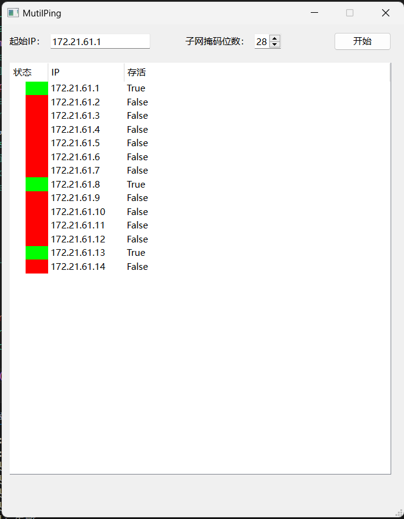

# 在线IP检测工具（multiplePing）

作者：楷|环境：Windows 24H2|Python：Python3.8.19

这个工具使用PySide6开发，依赖ipaddress和subprocess，实现对一个范围内的IP进行检测

## 功能

提供IP段和子网掩码位数，通过Ping（2次）检查范围内的IP是否可通，默认分批最多一次进行50个IP的检测

## 子网掩码

具体请查看这篇博客

[子网掩码换算工具_清华](https://iiis.tsinghua.edu.cn/ip/)

## 使用

在程序界面，输入IP（目前只支持IPv4），设置掩码位数，点击开始

## 开发

错误：

[ ] - 新的检测开始时，旧的检测未被停止

